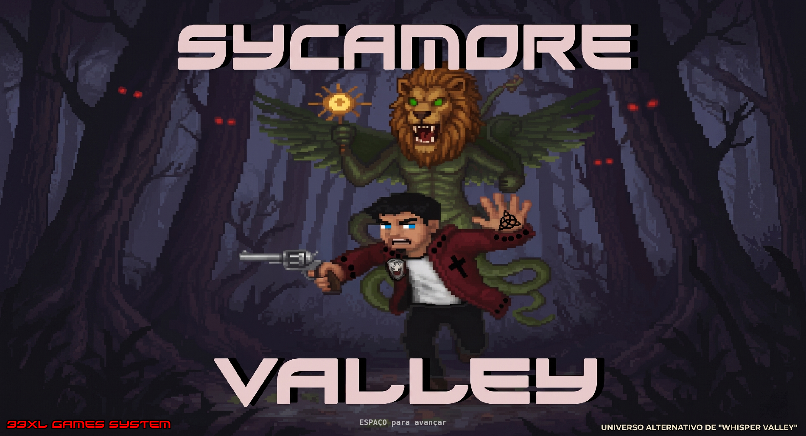

# WHISPER VALLEY - REMAKE BY 33XL GAMES SYSTEM

<div align="center">
  
</div>

**Whisper Valley Remake** é a recriação definitiva e modernizada do [**universo original**](https://caio-oliveiraa.github.io/whiper-valley/), um projeto com raízes profundas que não apenas marcou o início de uma importante jornada no desenvolvimento de jogos, mas também serviu de inspiração direta para a criação do meu outro projeto: o vasto universo alternativo (AU) de [**Sycamore Valley**](https://sycamore-valley-game.vercel.app/). Mais do que um simples jogo novo, este remake é um esforço apaixonado de preservação histórica, construído do zero para honrar a essência, a arte e o mistério do jogo clássico, ao mesmo tempo em que eleva a experiência técnica para os padrões atuais e um convite para as pessoas conhecerem Sycamore Valley.

## 🏫 A Origem: Whisper Valley

Originalmente documentado com o nome completo de **"The Mystery of Whisper Valley"** (embora tenha ficado carinhosamente conhecido apenas como *Whisper Valley*), o projeto nasceu como um trabalho em grupo da graduação de Análise e desenvolvimento de sistemas - UNICEPLAC, Matéria focado em desenvolvimento de games com Javascript. O que começou como uma simples entrega acadêmica acabou se tornando o ponto de partida para uma trajetória inteira no desenvolvimento de jogos e criação de novos universos.

O projeto original de Whisper Valley foi um marco criativo muito importante para mim. Como uma iniciativa de preservação e revitalização, este remake foi criado para manter a obra original viva e acessível. A ideia é refazer o jogo do zero, mantendo a proposta original e utilizando tecnologias web modernas (**TypeScript, Vite e motor Phaser 3**), o que garante estabilidade e fluidez sem perder a essência.

### 📜 A Lore de Whisper Valley

A história acompanha um mistério denso. Após o fracasso de sua última publicação no jornal, o protagonista Ethan Graves é enviado por seu chefe a Whisper Valley. Para ele, no entanto, a viagem tem um propósito muito mais profundo e pessoal: investigar o misterioso desaparecimento de seu melhor amigo, Miguel. Ao chegar na isolada e silenciosa cidade, ele descobre que os moradores vivem sob a "sombra viva" de um culto letal conhecido como **Abraxas**. O enredo culmina na terrível descoberta de que o próprio protagonista foi atraído para se tornar um sacrifício humano nas oferendas macabras da seita.

### 🟢 ETHAN GRAVES:

**Ethan Graves** é o jornalista que protagoniza *Whisper Valley*. Visualmente, ele veste uma jaqueta verde, camisa cinza, calça jeans azul, possuindo cabelos e olhos castanhos. Em forte contraste ao seu sucessor do Universo Alternativo, Ethan tem uma personalidade melancólica, curiosa e notavelmente mais calma. Movido pelo luto do desaparecimento de Miguel e pelas pressões de seu chefe, sua jornada é pautada na busca desesperada pela verdade em uma cidade que se esconde do resto do mundo e silencia as próprias tragédias.

# 🌲 SYCAMORE VALLEY - AU GAME

<div align="center">
  
</div>
<div align="center">
 
  ## [Acesse Sycamore Valley aqui! 🌲](https://sycamore-valley-game.vercel.app/)
</div>

Embora *Sycamore Valley* tenha nascido como um Universo Alternativo (AU) construído sobre a fundação de Whisper Valley, ele evoluiu drasticamente e conquistou uma identidade própria, independente e madura. O projeto se transformou em um intenso jogo de *pixel-art horror metafísico* com uma *lore* profundamente psicológica e autoral. 

Na narrativa, acompanhamos **Evan Brecht**, um Agente da AIP (Agência de Investigações Paranormais) que investiga misteriosos desaparecimentos em um vale isolado. O jogo subverte o terror tradicional ao introduzir ameaças que refletem traumas humanos e manifestações do ego, lideradas pelas entidades do "Triângulo do Aprisionamento" (Yaldabaoth, a Noite Escura e Schadenfreude) e por cultos como a Seita *Lichtkind*.

Para sobreviver e explorar a Fenda cósmica escondida na cidade, Evan utiliza o **Sigilo de Brecht** — uma marca arcana que lhe concede poderes dimensionais. Isso se reflete diretamente no *gameplay*, permitindo ao jogador alternar fluidamente entre a perspectiva clássica Top-Down (Mundo Real) e uma visão 2.5D Isométrica (O Véu). A jornada é construída através de *stealth*, puzzles elaborados, o perigo das *Mortes Simbólicas* (onde mentes estagnadas colapsam em abstrações visuais) e um denso sistema de escolhas morais que culmina em 9 finais diferentes.

Este AU é o maior testamento de como a semente plantada no projeto acadêmico original de *Whisper Valley* germinou, aproveitando suas raízes de mistério para criar um universo investigativo e sobrenatural vasto.

### 🔴 EVAN BRECHT:

Apesar da sonoridade dos nomes ser parecida, em *Sycamore Valley* o protagonista ganha uma roupagem e um peso narrativo completamente distintos. **Evan Brecht** possui pele levemente parda (nacionalidade latina-germânica), cabelos pretos e olhos azuis. Veste uma marcante jaqueta vermelha com bolinhas pretas nas extremidades das mangas, contendo duas cruzes (uma no coração, outra maior nas costas) e o emblema da A.I.P. no peito direito, sobre uma camisa branca e calça jeans cinza. Ao contrário da melancolia calma de Ethan, Evan é mal-humorado, porém intensamente altruísta e determinado a resolver problemas fora de seu alcance. Coordenado por sua avó (a professora Hilda Brecht), ele investiga o desaparecimento de seu tio mais velho, Amadeus Stein Brecht. Nessa jornada, ele não lida apenas com cultos como a *Lichtkind* (Filhos da Luz), mas bate de frente com realidades metafísicas e entidades surreais.

## 🤝 A Dinâmica do Projeto Original

Para entender este Remake, é fundamental conhecer a dinâmica do jogo original. Eu e o Caio tomamos juntos grande parte das decisões criativas:
- **Eu (Cauan)**: Fui o responsável pela criação de todos os Assets de arte e design. Além disso, programei a lógica que permitiu que o *spritesheet* do *player* funcionasse no código original.
- **Caio**: Foi o responsável por desenvolver 90% do código e estruturação do jogo original.

- 🎮 **[Jogue a versão original clássica aqui!](https://caio-oliveiraa.github.io/whiper-valley/)**

- 🔗 [Acesse aqui o repositório original pertencente ao Caio](https://github.com/Caio-oliveiraa/whiper-valley).

## 🏆 Créditos da Obra Original
Um agradecimento especial e todos os créditos aos criadores originais do universo de Whisper Valley:
- **[Caio](https://github.com/Caio-oliveiraa)**
- **[Cauan](https://github.com/Cauan33XL)**
- **[Anna](https://github.com/AnnaFerreira18)**
- **Filipe**
- **Gabriel**

## ⚙️ Remake e Distribuição
Remake reescrito, otimizado e distribuído através da minha plataforma: **[33XL GAMES SYSTEM](https://33xl-games-system.vercel.app/)**.

---

## 🚀 Como Executar o Jogo Localmente

Certifique-se de ter o [Node.js](https://nodejs.org/) instalado em sua máquina.

1. **Instale as dependências:**
   ```bash
   npm install
   ```

2. **Inicie o servidor de desenvolvimento:**
   ```bash
   npm run dev
   ```
   O jogo estará disponível no navegador, geralmente no endereço `http://localhost:3000`.

3. **Para compilar o jogo para Produção / Deploy:**
   ```bash
   npm run build
   ```
   O jogo minificado e otimizado será gerado na pasta `dist/`.

## 📜 Licença
Este projeto está sob a Licença MIT. Veja o arquivo [LICENSE](./LICENSE) para mais detalhes.
